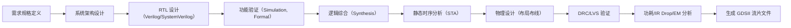

# 🧠 IC 设计基础知识大全（结构化笔记）

---

## 🏢 1. IC 设计公司的分类

### 🔹 按照业务模式分类：
| 公司类型 | 说明 | 代表公司 |
|----------|------|----------|
| Fabless（无晶圆厂设计公司） | 专注芯片设计，将制造交给晶圆代工厂 | 高通、联发科、华为海思 |
| IDM（集成设备制造商） | 自主完成设计、制造、封装等全流程 | 英特尔、三星、德州仪器 |
| Foundry（晶圆代工厂） | 不做设计，仅提供制造服务 | 台积电、中芯国际、格芯 |
| OSAT（封装测试厂） | 提供封装和测试服务 | 日月光、长电科技、通富微电 |

---

## 🧱 2. 数字 IC 设计流程（RTL → GDS）

### ✅ 每一步核心内容
RTL 设计：使用 Verilog / SystemVerilog 编写功能模块
功能验证：Testbench + UVM 等方法确保设计正确
综合：将 RTL 转换为门级网表
STA：检查时钟约束是否满足
P&R：进行布局布线，生成物理结构
DRC/LVS：检查物理规则、电气连接是否正确

---

## 🎛️ 3. 模拟 IC 设计流程（SPICE → 版图）
流程步骤：
 - 绘制原理图(Schematic)
 - 仿真原理图
 - 版图绘制（Layout）：用 Virtuoso 等工具手动设计几何图形
 - 版图后仿：寄生提取后再仿真, 功能仿真（DC, AC, Transient）
 - 设计规则检查(Design Rule Check, DRC)
 - Layout vs Schematic, LVS 一致性检查
 - Tape-out：输出 GDS 文件准备流片

---

## 🧩 4. 芯片整体规划（Top-down 视角）
- 版图布局规划FloorPlan: 估计芯片总面积、总成本，用什么工艺，选哪家Foundry
- Pad: 芯片引脚上的一块金属，将芯片焊接在电路板上
- I/O: 包括Pad和内部逻辑在内的整个引脚设计

---

## 🛠️ 5. 主流 IC 设计工具链

### 🔹 数字 IC 工具（EDA 三巨头）
| 阶段      | 工具（常见）                                       |
| ------- | -------------------------------------------- |
| RTL 编辑  | Vim, VSCode, Vivado                          |
| 功能验证    | Synopsys VCS, Cadence Inclusive                |
| 逻辑综合    | Design Compiler (Synopsys), Genus (Cadence)  |
| STA     | PrimeTime (Synopsys), Tempus (Cadence)       |
| 布局布线    | IC Compiler II (Synopsys), Innovus (Cadence) |
| DRC/LVS | Calibre (Mentor), Pegasus                    |
| 功耗分析    | PowerPro, Voltus                             |

### 🔹 模拟 IC 工具
| 阶段    | 工具                       |
| ----- | ------------------------ |
| 原理图设计 | Cadence Virtuoso         |
| 仿真    | Spectre, HSPICE          |
| 版图绘制  | Virtuoso Layout          |
| 寄生提取  | QRC, StarRC              |
| 后仿    | Spectre APS, Monte Carlo |

## 👥 6. IC 公司内部分工与职位
| 职位名称      | 职责描述                      | 所需技能               |
| --------- | ------------------------- | ------------------ |
| 数字电路设计工程师 | 编写 RTL，优化性能与面积            | Verilog, STA, 综合   |
| 数字验证工程师   | 编写 testbench，使用 UVM 等进行验证 | SystemVerilog, UVM |
| 模拟电路设计工程师 | 设计放大器、LDO 等模拟模块           | SPICE, 版图匹配经验      |
| 模拟版图工程师   | 将模拟电路转换为物理图形，DRC/LVS 清洁   | Virtuoso Layout    |
| DFT 工程师   | 设计测试结构，提升可测性              | Scan chain, BIST   |
| 后端工程师     | P\&R、STA、DRC、IR drop 等    | EDA 工具使用经验         |
| 封装工程师     | 芯片封装设计、热仿真等               | 材料学，热学分析           |

